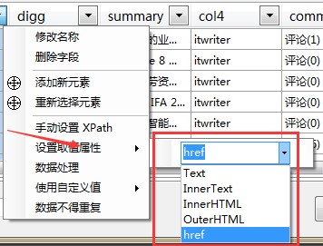

取值属性

首先，字段通过 **XPath** 定位查找到 Html 元素，然后我们就需要通过**取值属性** 来确定 Html 元素的哪个部分来作为字段值。

一般情况下，采集器默认使用 *InnerText* 属性（当前节点以及其子节点的文本）

除了 *InnerText*，还有其以下内置属性：

* *Text* ，表示当前节点的文本
* *InnerHtml*，表示当前节点内部的 HTML 语句（不包括当前节点）
* *OuterHtml*，表示当前节点的 HTML 语句

常用的属性还有：

* *href*，表示链接地址（A标签<a）
* *src*，一般表示图片地址（IMG标签<img）
* *class*，表示样式（css）
* *data-**，表示一些数据类型

除了内置属性外，用户可以**手动填写 HTML 属性**。 

***特别提示：这里是可以手动输入属性名称，即使下拉选项中没有。比如常见的onclick、value、class。**