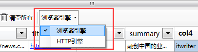

爬山虎采集器V2内置了3种引擎，**浏览器引擎**、**HTTP 引擎**、**JSON 引擎**。

**浏览器引擎**，同一般浏览器一样，它会加载、执行`JavaScript`，在采集一些动态类型、使用Ajax加载数据的网站，必须要使用浏览器引擎。

**HTTP 引擎**，它直接使用 HTTP 协议进行访问网址。仅用于静态网页，或者说数据是非动态加载的网站。使用 HTTP引擎的速度非常快，并且可以使用多线程，更加快了采集速度。

**JSON 引擎**，用于解析JSON数据，基于HTTP协议，与上面2种不同的是，在JSON 引擎下，使用JSONPath来解析数据。

---

你可以根据具体网页的类型，选择引擎。 

如何确定要使用哪种引擎呢？ 
很简单，当切换到 *HTTP 引擎*时，观察所有字段的数据，如果有数据，且正确。那么就可以使用 *HTTP 引擎* 。否则就使用 *浏览器引擎*。

---

**JSON引擎的使用场景**：

1. 对于熟悉浏览器抓包的用户（浏览器F12或者Fiddler的使用），可以尝试分析网页的JSON请求（AJax）,来实现数据的采集。 
2. 使用JSON引擎，可以采集手机APP数据。

**JSON引擎的优缺点**：

* 优点：jSON数据干净、整洁、容易处理，并且采集速度快。
* 缺点：学习门槛较高，需要抓包分析。