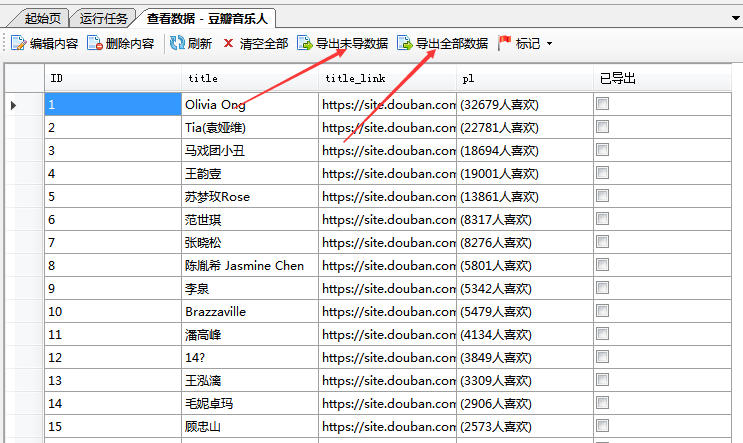

数据导出

爬山虎采集器支持多个格式的数据导出（发布），包括TXT、CSV、Excel、Access、MySQL、SQLServer、SQLite以及发布到网站接口（Api）。


导出方式有2种：

* 手动导出，通过`右击任务`-> `导出任务`，或者是在`查看数据`中导出。
* 自动导出，在编辑任务的第三步中设置导出。




在数据导出后，会被标记为*已导出*，在下次导出时，不会再导出。 如果想要导出全部数据，而不区分*已导出*，可以在`查看数据`中选择`导出全部`。

---

###导出到Excel、CSV、TXT
可以将数据导出到Excel、CSV、TXT文件中，每次导出将会生成新的文件。 
软件支持对导出的文件名设置变量，目前有2种格式变量，按照`任务名`和`日期格式`。


导出TXT目前支持一条记录保存为一个文件。可以根据字段值来定义文件名称，导出的内容格式也可以自定义模板


---

###导出到网站接口（API）
支持主流CMS网站系统，比如Discuz、帝国CMS、Wordpress、DEDE CMS、PHP CMS，官方可以提供接口文件（API）。

对于开发人员，可以自己定义网站API，爬山虎采集器的通过HTTP POST请求将数据发送指定的API，设置对应的POST（application/x-www-form-urlencoded）参数、编码类型即可


POST示例参考   
```
POST http://www.example.com HTTP/1.1 
Content-Type: application/x-www-form-urlencoded;charset=utf-8 

title=example_title&content=example_content&channel=2

```
---

###导出到数据库
目前采集器支持导出到MySQL、SQLServer、SQLite、Access四种数据库，设置好数据库的连接配置，指定导出的目标表名称。 

同时，可以设置本地的任务字段与目标数据库字段之间的映射关系（对应关系）


数据库的字段映射设置

