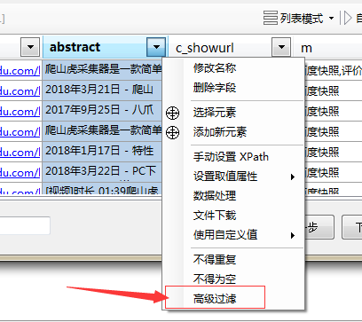
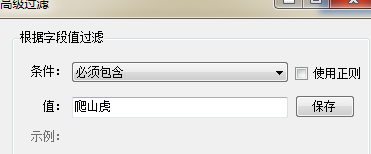
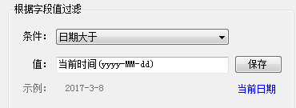
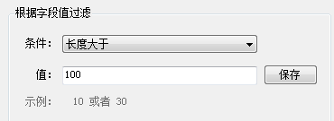

###高级过滤

在采集的时候，我们需要对数据进行一些过滤筛选，比如`不能包含`某些关键词、`必须包含`某些关键词、`价格大于`xxx、`日期大于`xxx，就可以使用**高级过滤**功能。

###如何设置？

点击对应字段的下拉菜单，点击**高级过滤**。

高级过滤的窗口界面   

###具体过滤条件介绍

*只有符合条件的，才会保留下拉，不符合条件的就会丢弃*

1. **必须包含、不得包含**：设置字段内容包含关键词、不得包含关键词，支持`正则表达式`。

2. **数字大于、小于**： 对字段值为数字类型的进行过滤，比如价格、销量，值可以为`整数、浮点数`。  

3. **日期大于、小于、等于**：对采集到的时期进行过滤，比如采集新闻，就可以过滤掉今天之前的内容，只采集当天。   

4. **长度大于、小于**： 通过字段内容的长度进行筛选，可以过滤掉长度过短、过长的内容。  
