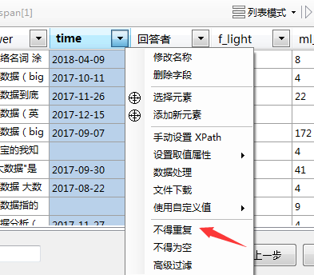
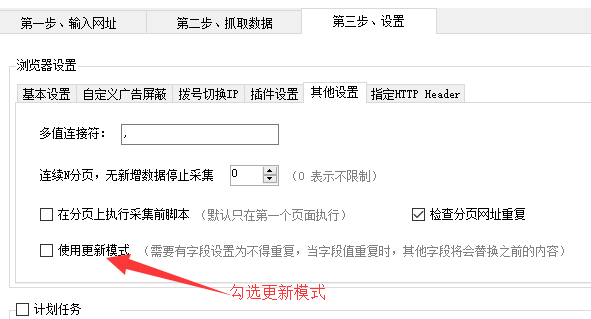

增量更新，简单来说，就是只采集网页中*新增的内容*，之前已经采集到内容不会重复采集。

---

如何设置增量更新？

首先，我们要选择一个字段，这个字段能够保证这条记录是`唯一`的。 比如新闻标题、内容页链接。
然后，点击字段下拉列表。 选择 `不得重复`。

---

### 更新模式

如果我们要对采集的数据进行更新采集，比如我们要采集一篇文章每天的阅读量，并且更新。 我们就需要使用**更新模式**

设置更新模式，我们需要选择一个**不得重复**字段，比如采集文章的话，可以设置文章地址为不得重复字段。