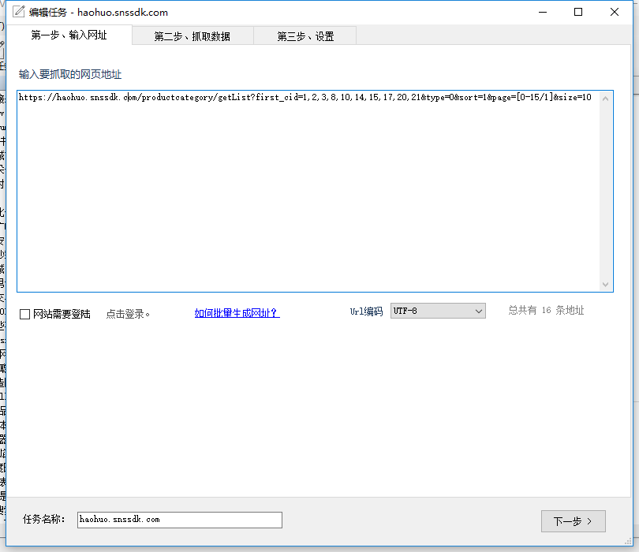
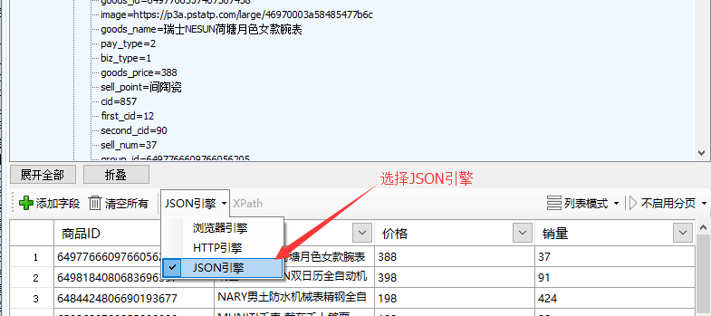
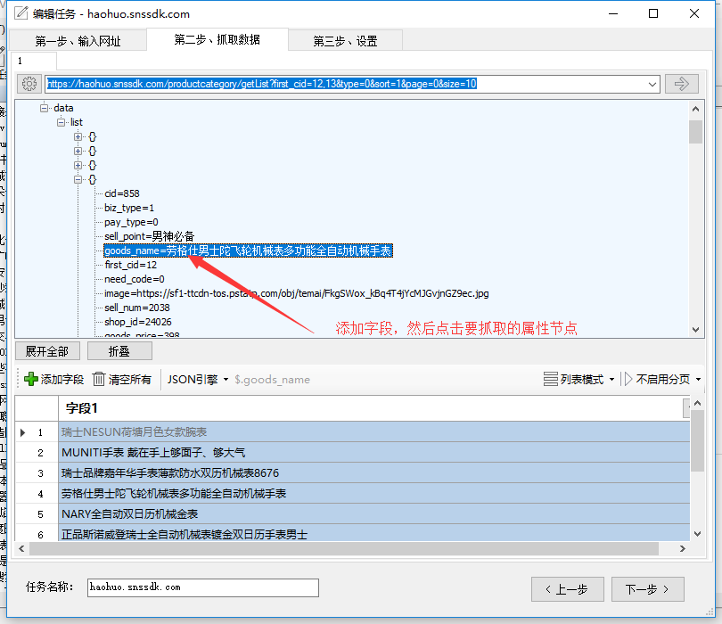
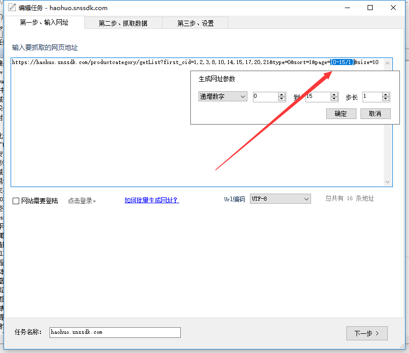

JSON数据采集

使用爬山虎采集器可以采集JSON格式数据，使用JSON引擎可以大大提高采集效率，并且JSON格式数据一般不需要二次处理，数据干净、整洁。

###如何采集JSON数据？

前提，一般需要通过浏览器抓包找到JSON数据的请求地址（URL），用浏览器自带的调试工具（F12)或者Fiddler都可以实现抓包。

首先，在爬山虎采集器中，新建任务，把找到JSON的请求地址复制到起始地址中。

然后，点击下一步进入到抓取数据页，设置引擎为**JSON引擎**。

如果要抓取的JSON数据是一个列表，则设置模式为**列表模式**。 在列表模式下，我们点击选择列表。

然后，添加字段，点击需要抓取的一个属性节点。

以此类推，新建其他字段。

###JSON的头信息验证

在部分JSON请求中，Http header中会有一些验证信息，比如Authorization，必须要加上这些头信息才能获取到数据。
先通过抓包工具获取，然后在复制到采集器中。

###JSON的分页采集

一般JSON请求的分页参数都是在请求地址中，类似参数如*page,pn,p*，通过抓取工具可以分析得到。
在通过分析出分页参数的构成后，我们在第一步中，来通过采集器中的**批量生成网址**来构建分页请求。
