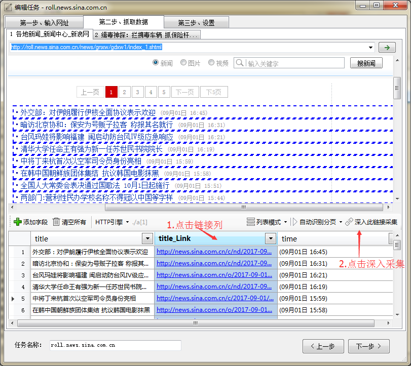
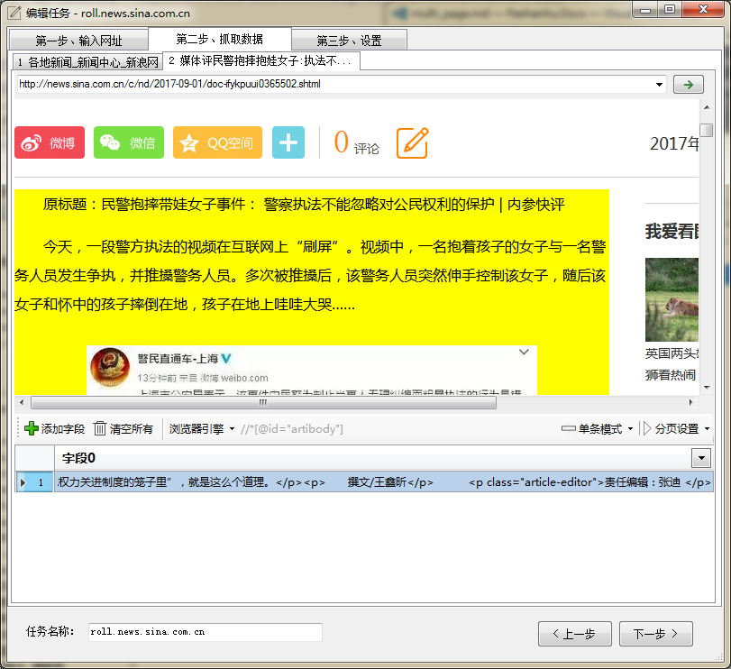
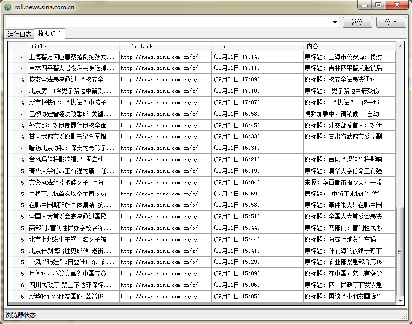
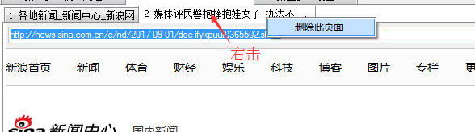

### 介绍
在创建第一个任务示例中，我们演示了如何采集列表页数据。 有时我们不仅要采集列表页数据，还要采集内容页。下面就来介绍下如何采集多级页面。

以[新浪新闻](http://roll.news.sina.com.cn/news/gnxw/gdxw1/index_1.shtml)为例，我们要采集采集最新的新闻标题、时间、内容。

首先，输入起始网址，[http://roll.news.sina.com.cn/news/gnxw/gdxw1/index_1.shtml](http://roll.news.sina.com.cn/news/gnxw/gdxw1/index_1.shtml)，点击`下一步`。

程序自动分析出列表数据，然后点击蓝色`链接列`的列头。这时，工具栏出现`深入此链接采集` ，点击该按钮。

然后浏览器会新建一个内容页的标签页。 在内容页标签页中，点击`添加字段`，然后在浏览器中点击新闻内容，修改字段名称为*内容*。

然后，下一步，完成。 我们测试下任务

---

### 如何手动采集链接
一般情况下

1. 新建字段，点击需要采集的链接。
2. 把[取值属性](attribute.md)修改为**href**

部分使用`javascript` 来跳转的链接需要我们手动组合链接地址( href值为空，或者类似`javascirpt:xxx()`)

---

如何删除一个标签页？ 右击浏览器标签页的顶部，选择`删除此页面`。
        
