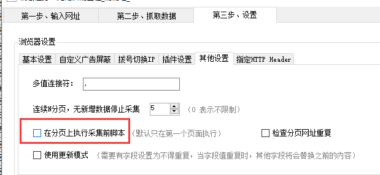

通常，列表页都会有分页，如何采集分页中的数据呢？

---

###自动识别分页
爬山虎采集器可以识别90%的分页元素，通过选择`分页设置`->`自动识别分页` 。

###手动设置分页
当不能自动识别时，我们就需要手动设置分页。如何手动设置分页？

1. 首先选择`分页设置`->`手动设置分页` ，
2. 在点击`选择分页元素`，在浏览器中找到`下一页`元素并点击。

###瀑布流分页

现在很多网页都是用了瀑布流分页技术，比如百度图片、知乎、今日头条，这类型网页，直接选择**瀑布流分页**。 采集器会自动滚到网页，直到分页完成。

###瀑布流+分页页码的组合形式
有部分网站，会使用瀑布流+分页页码的形式来展示，比如向下滚动5次后，才会展示分页页码。 步骤如下：

1. 使用[脚本命令](script.md)，手动添加一个`滚动命令`，具体设置滚动几页、滚动间隔时间，需要针对具体网站进行测试。
2. 第三步设置，在`其他设置`中，勾选`在分页上执行采集脚本`，这样在每次打开分页后，都会执行滚动命令。

### 加载更多形式
有些网站会使用**加载更多**这样的按钮，点击才会展示更多数据。 采集这种类型的页面，我们需要`手动设置分页`, 把**加载更多**当作下一页按钮来点击。

---

**设置采集最大分页**

可以设置要采集的最大分页数量。这在更新采集时，非常必要。比如每天网站更新的内容都在前3页中，我们就可以设置最大分页为3页。
