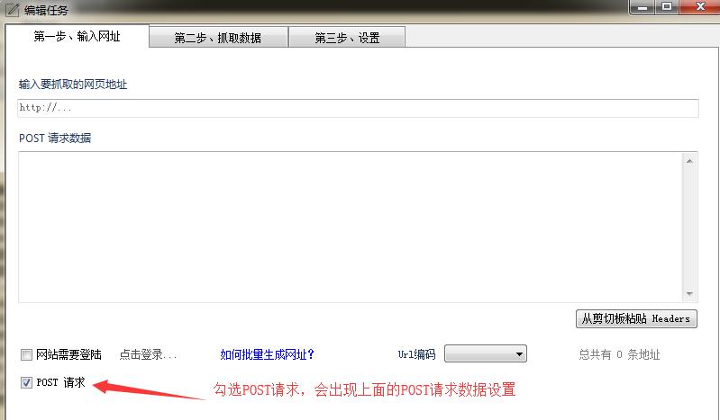
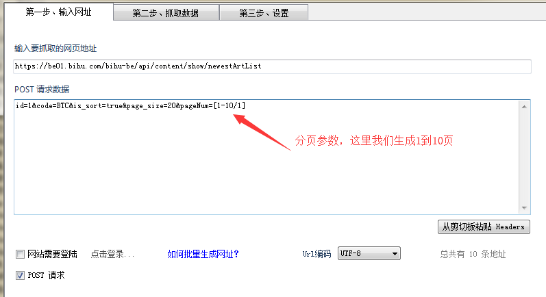
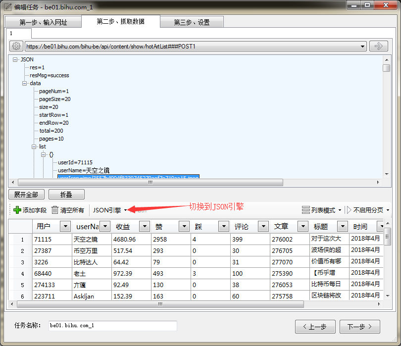
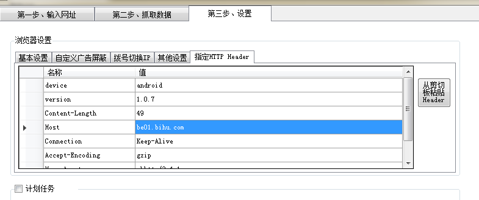

###介绍

POST 请求是使用HTTP协议的POST方法进行请求的方式，区别于GET请求，POST请求一般是将参数数据放在POST Body(POST 数据体)中。而GET请求的参数都是放在URL中。

### 前提
要使用POST方式进行采集，首先需要学习抓包技术，通过Chrome `F12`（开发者工具->Network） 或者`Fiddler` 工具来进行抓包。

###第一步 设置POST请求

新建任务，在第一步，选中`POST 请求`，出现POST请求数据的设置。

通过之前的抓包工作，定位到我们需要的POST请求，把POST请求的URL和POST数据复制过来。 一般来说，我们直接复制整个请求（包含URL、Header、POST Body），然后点击按钮`从剪切板粘贴Header`，一键复制请求数据。

复制完成之后，需要对POST数据进行分析，找到其中参数，比如`分页`、`查询关键词` 之类，用批量网址参数进行处理。

###第二步 配置抓取数据

大部分情况下，POST请求的返回数据都是JSON格式，在第二步中，我们直接把引擎切换为JSON引擎就可以了。 剩余部分可以参考[JSON数据采集](json.md)

###Header设置
在使用POST方式采集时，很多时候需要跟Header打交道，因为有些网站或APP会将一些验证放在Header中，比如常见的Auth。

在`第三步`->`指定Header设置` ，可以对这些进行修改。 包括UA、Cookie等等Header。
