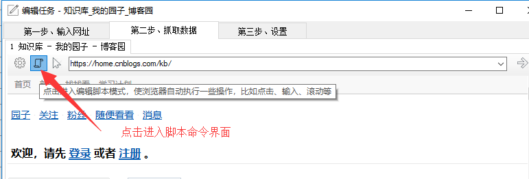
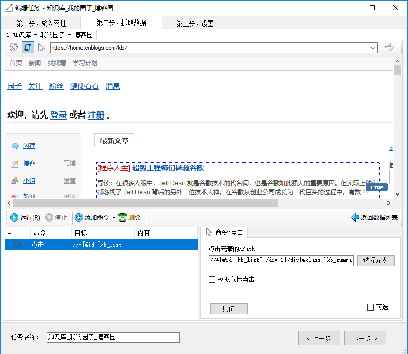

**采集前执行脚本**

这个功能主要针对一些单页应用（需要填写表单、点击等操作，URL不变），比如百度地图（ditu.baidu.com）,需要先输入查询关键词，在点击查询，才会出现结果数据。 还有其他一些需要输入筛选条件，比如时间、分类等条件的查询页面。

**如何进入？**

点击地址栏左边的工具图形按钮，点击“编写脚本命令” 即可。 编写脚本命令

编写脚本，十分简单，只要在浏览器中点击、输入即可。

**命令类型：**

1. **点击**， 鼠标点击命令
2. **输入**，对一些表单元素进行输入，比如文本框、下来列表、复选框等待
3. **等待**，等待指定长的时间
4. **滚动**，对于一些网页，需要滚动下拉，才能够采集或者其他操作
5. **运行 Js**，在网页中运行JavaScript 代码，能够执行复杂操作。可以运行JQuery

**向导模式和正常模式**

* 在向导模式下，对浏览器点击、输入操作，都会自动生成相应的命令。 
* 在正常模式下，则会像正常浏览器一样，不会生成命令。

