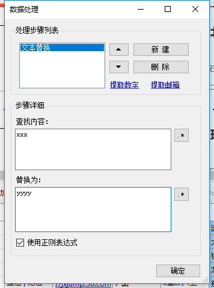
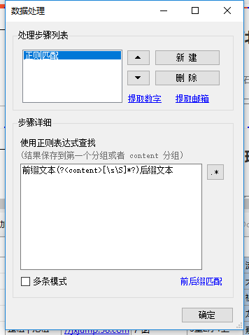
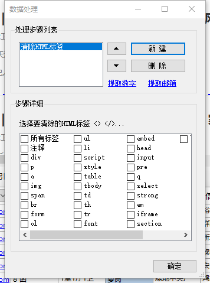
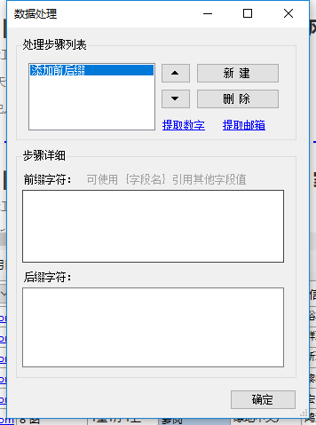
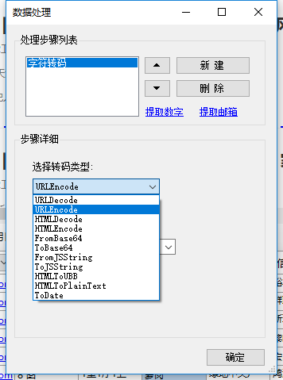

其他设置

一般情况下，我们采集到的网页数据需要进行二次处理，比如替换关键词、移除空白字符、进一步提取、格式转换、HTML标签处理等等。  

如何设置？点击字段的菜单按钮，选择`数据处理`。 然后点击`新建` 处理步骤。  

爬山虎采集器提供一下几种处理步骤：

###文本替换

对字段内容进行查找并替换为指定的字符，支持`正则表达式`。 勾选正则表达式后，右侧`.*`按钮有常见的正则表达式语法菜单。 在替换内容中支持`$1` `$2`这样的分组替换功能。


###正则匹配

使用`正则表达式`对内容进行提取。比如提取一段内容中的数字、日期等数据。默认是从content分组或者第一个分组结果中提取内容，例如，提取数字的表达式就是`(\d+)` 或者`(?<content>\d+)`


* **多条模式**： 勾选多条模式后，如果匹配到多条结果，程序会将结果使用指定的连接符拼接后返回。
* **前后缀匹配**： 通过这个快捷链接，我们可以快速生成一个正则表达式`前缀文本(?<content>[\s\S]*?)后缀文本`，然后我们可以把前缀、后缀文本替换为指定字符。 
比如提取`百度为您找到相关结果约11,900,000个`中的`11,900,000`，表达式就是`结果约(?<content>[\s\S]*?)个`。


###清除HTML标签
通过该功能，可以移除掉指定的HTML标签。 比如去掉A标签、IMG标签、DIV标签等等。




###添加前后缀

对字段内容添加前后缀，组合出一段新的内容。通常用在拼接网址上，比如，当前字段内容为`baidu`，我们设置前缀为`http://www.`，后缀为`.com`，那么返回结果为：`http://www.baidu.com`



可引用改字段之前的字段值，引用方式`{字段名称}`（注意：被引用字段的顺序必须在当前字段之前）。  


###字符转码
包含了常见的HTMLEncode,HTMLDecode,UrlEncode,UrlDecode,JSEncode,JSDecode, Base64等转码形式。



* `ToDate` 为新增类型，可以转换时间戳为指定时间格式，可以从内容中提取去日期，并且格式化。
* `HTMLToUBB` 将HTML格式转换为UBB代码（一种论坛格式代码）
* `HTMLToPlainText` 将HTML代码转换为文本格式，并且保留格式（p、br、li等块标签替换为换行）


###执行JavaScript

运行一段JavaScript代码，可以做一些复杂的数据处理，比如运算、字符串操作。可以引用其他字段值。


###执行C#代码
通过 C# 代码对当前字段内容进行处理。
函数参考： `string Run(string content)` ，其中content参数为当前字段的内容，返回值为处理后的结果，字符串类型。

比如 `return content.Length.ToString()` ，结果是当前字符串的长度。

###正文提取
通过正文提取算法，将页面中的正文和标题自动识别并提取，适用于一般的新闻、文章页面。 可以选择提取标题或者正文，以及是否提取A标签、图片标签

###字符映射
对字段内容进行批量替换。应用场景，将目标网站的分类、栏目映射为自己网站的分类。 比如把a,b,c 映射为1,2,3。 
输入格式**一行一条**，查找和替换值之间用**英文逗号**分隔。


格式参考：
```
a,1
b,2
c,3
```

##HTTP请求
可以构造一个HTTP请求（支持`POST`，可以引用其他字段值)，并将请求的响应作为处理结果。 
