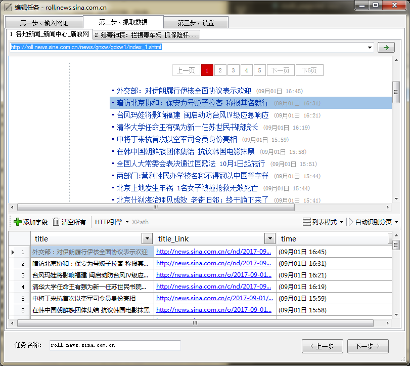
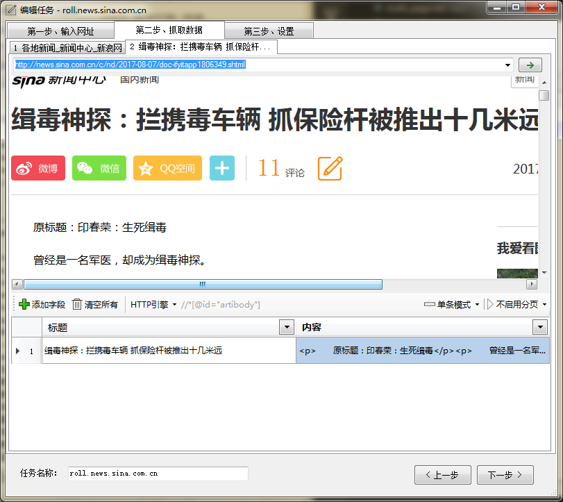
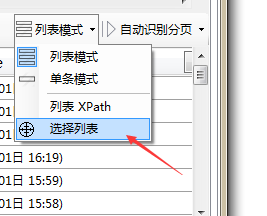

**列表模式** ，顾名思义，就是针对包含多条数据记录的页面，我们一般称为**列表页**。

比如百度、谷歌的搜索结果页面，就是一个典型的列表页。 如果我们想要从这种页面提取出多条结构相同的数据，我们就要选择**列表模式**。

---

**单条模式**，就是仅采集一行数据记录。 

这种模式用于采集**内容页**。比如一般博客、新闻网站的内容页，或者叫详情页面。

---

**字段 XPath在列表和单条模式下的区别**

列表模式下，字段是在列表中的**一个节点**中进行匹配，XPath 是以`./`开头，表示当前节点的意思。而单条模式时，字段是在**整个页面**中进行匹配的。

---

**如何设置列表：**

1. 自动识别列表，当新建任务，输入起始网址后，程序会自动识别页面中的列表数据，并且生成数据字段。
2. 手动选择列表，当自动识别的结果不是想要的数据时，我们可以手动选择列表数据。 具体参考 [如何手动选择列表](http://www.51pashanhu.com/detail/135)
    
    
