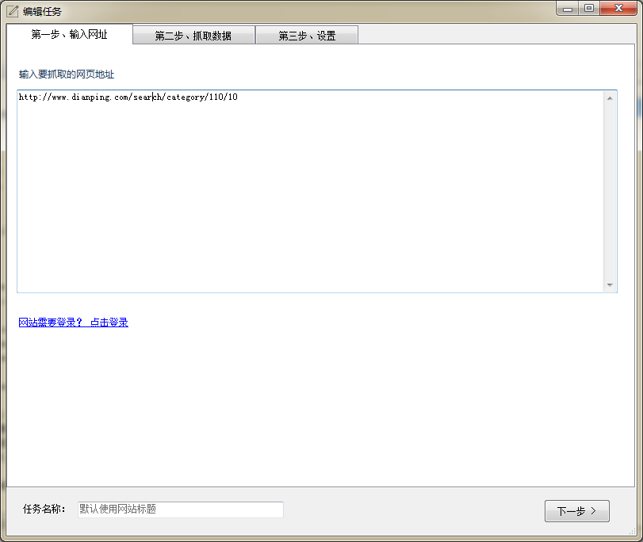
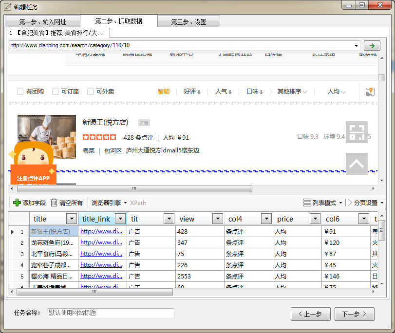
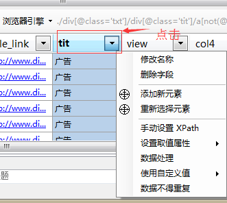
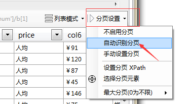
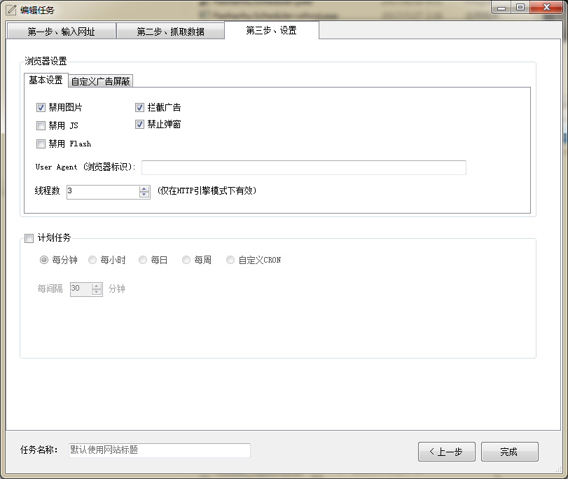
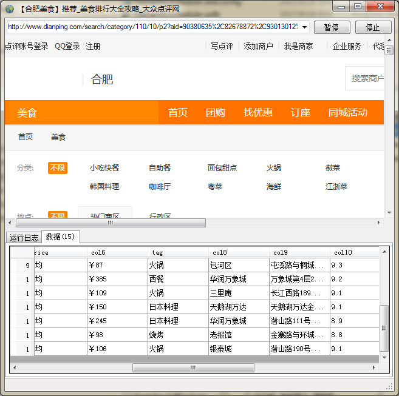

# 第一步、选择起始网址

当你想要采集一个网站数据时，首先需要找到一个展示数据列表的地址。 这一步，至关重要，起始网址决定了你采集的数据数量和类型。

以[大众点评](http://www.dianping.com/)为例，我们想要抓取当前城市的`美食`类的商家信息，包括店名、地址、评分等等信息。

通过浏览网站，我们找到所有美食类的商家列表地址：
[http://www.dianping.com/search/category/110/10](http://www.dianping.com/search/category/110/10)

然后在爬山虎采集器V2中 `新建任务` -> `第一步` -> `输入网页地址`

然后点击`下一步`。

---

## 第二步、抓取数据

进入到第二步后，爬山虎采集器会智能分析网页，并且从中提取出列表数据。 如下图：

这时，我们对已经分析出的数据进行整理修改， 比如删掉无用的字段。

点击列的下拉按钮，选择 `删除字段` 。

当然还是其他操作，比如`修改名称`,`数据处理`等等。这些我们将在后面的文档中介绍。

在整理修改字段后，我们来采集处理分页。 

选择`分页设置`->`自动识别分页`，程序将会自动定位`下一页` 元素。

完成之后，点击`下一步`。

---

## 第三步、设置

这里包括对浏览器的配置，比如禁用图片、禁用JS、禁用Flash、拦截广告等等操作。可以通过这些配置提高浏览器的加载速度。 

计划任务的配置，通过计划任务，可以设置任务定时自动运行。

点击`完成`，保存任务。

---

## 完成，运行任务

任务创建完成之后， 我们选择刚刚新建的任务，点击任务栏 `开始`。

