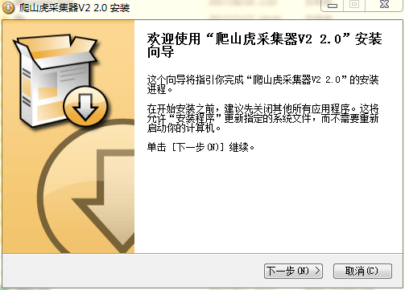
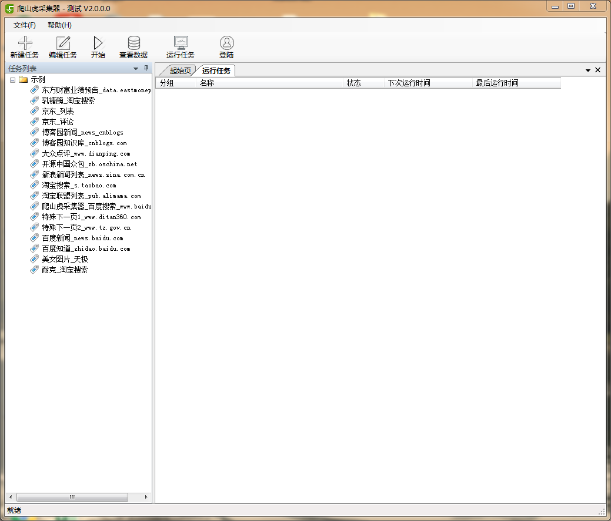

# 测试

* 可支持 **windows XP**以上的系统。
* .Net 4.0 Framework框架，[下载地址](http://www.microsoft.com/zh-cn/download/details.aspx?id=17718)

----------------
## 下载安装

1. 打开爬山虎采集器官网 `http://www.51pashanhu.com/`
2. 打开下载页面，点击下载安装程序。
3. 下载完成后，直接运行安装程序 `PashanhuV2Setup.exe`。
        
4. 然后一直点击下一步，直到完成。
5. 安装完成后，可以看到爬山虎采集器V2的主界面
        

