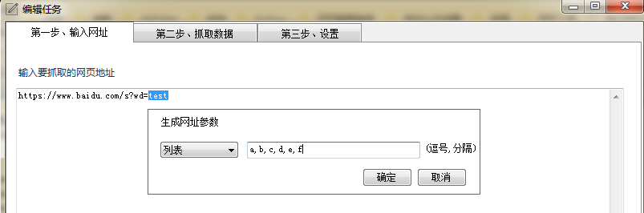
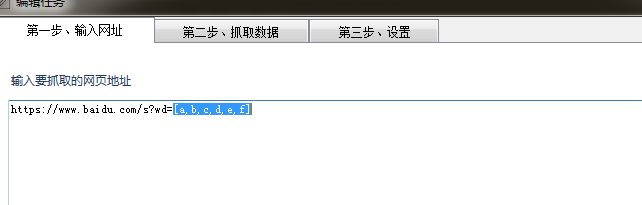
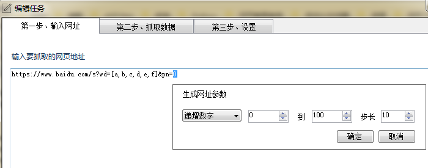
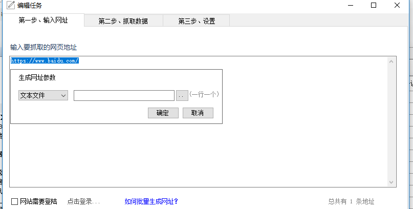

###网址参数介绍
在采集一些网站时，我们需要批量生成一批网址。 比如我们采集搜索引擎时，要许多不同关键词的搜索结果；以及批量生成分页地址。

我们以百度搜索为例，展示如何采集多关键词搜索结果。

首先，第一步输入网址 `https://www.baidu.com/s?wd=test`。
然后**鼠标选中**网址中的关键词`test`,这时会弹出**生成网址参数**窗口。 

这里有3种参数类型：

1. `递增数字`，按照给定的范围，生成出固定步长的数字。大部分用在生成分页地址上。 
2. `列表`，这种类型是给定一些固定字符串，程序根据这些字符串集合生成网址。常常用在搜索关键词、指定采集频道、目录。
3. `文本文件`，这种类型从指定的txt文件中读取所有行，一行一条记录，组成网址。常用来组合搜索的关键词网址

我们选择`列表`类型， 然后输入要采集的关键词，比如 a,b,c,d,e,f 。多个关键词以英文逗号,分割。

点击确定。这样就完成了批量生成多关键词的网址了。

---

### 生成分页参数

在上面的基础上，我们需要针对每个关键词，生成前10个分页的地址。

首先我们找到百度的分页参数是`pn`，起始为0，每页的步长为10。

那么我们要采集的网址就是`https://www.baidu.com/s?wd=test&pn=0`

先选择关键词，生成关键词列表。 然后选中`0`，选择 `递增数字`，设置起始为0，结束为100，步长为10。点击确定

可以看到最终的网址为`https://www.baidu.com/s?wd=[a,b,c,d,e,f]&pn=[0-100/10]`

### 从文本文件导入网址
有时我们需要从文本文件中批量导入一批网址来进行采集，如何设置？

1. 输入一个示例网址，比如`https://www.baidu.com/`。
2. 使用鼠标，**全部选中**这条网址
3. 在弹出的参数设置框，选择`文本文件`类型，然后选择包含批量网址的txt文件。

### []的转义

在某些网站的POST内容中，会包含[]这样的请求参数，而在采集器中[]会被认为是批量生成网址的格式，如果不做处理请求可能会出错。

我们可以在[]前面加入反斜杠\来，比如POST包含 `[x,y]`，修改之后变为`\[x,y]`