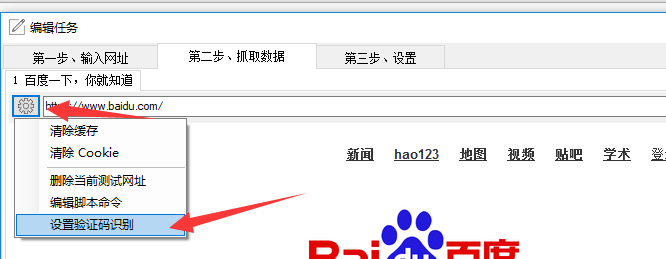
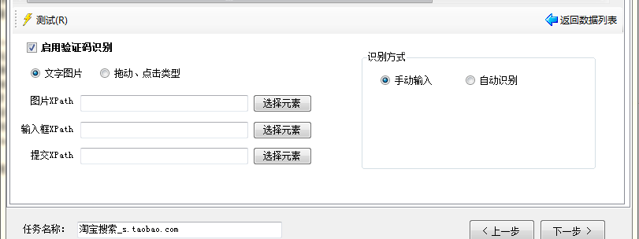
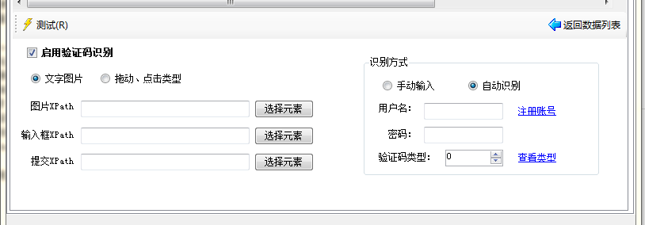

验证码识别

在采集数据时，在一些网站上采集太多、太快的话，会弹出验证码窗口，通过设置验证码识别，我们可以解决这个问题

**如何设置？**

点击地址栏左边的工具图形按钮，点击`设置验证码识别` 即可，进入到验证码设置界面。

在采集器中，验证码分为两种类型，一种是普通的图片识别验证码，一种是鼠标拖动、点击型。 

1. 对于图片识别验证码，需要设置`图片XPath`、`输入框XPath`、`提交按钮XPath`。
2. 对于鼠标拖动、点击型，只需要设置`图片XPath`。

当然设置都是点击“选择元素”，然后在浏览器中点击对应的元素即可完成。

识别方式分为两种:

1. 可以**手动输入**（鼠标拖动、点击型只能选择手动输入）
2. 可以接入**打码平台**来自动识别。

设置完成后，点击`测试`，来测试验证码配置。

