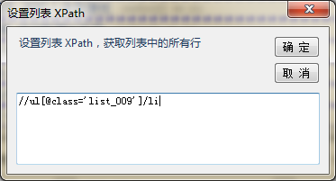
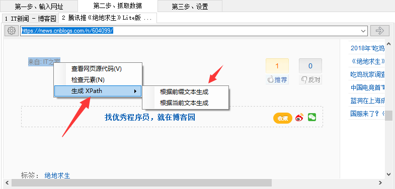

*XPath* 是一门在 XML 文档中查找信息的语言。*XPath* 用于在 XML 文档中通过元素和属性进行导航。

在爬山虎采集器中，我们用 *XPath* 来查找定位网页中的 Html 元素。 可以说 *XPath* 在采集器中是一个非常基础、非常重要的技术，在一些复杂的网页，可能需要手动 编写 *XPath* 表达式来解决问题。

具体的 *XPath* 知识，大家可用通过 [http://www.w3school.com.cn/xpath/index.asp](http://www.w3school.com.cn/xpath/index.asp) 来学习。

---

在爬山虎采集器中，**列表模式、手动设置分页、字段**中都是通过 XPath 来定位数据的。 都可以通过**手动设置 XPath** 来修改、完善 XPath 表达式

XPath 可以填写多条，以作为补充、备用。

建议：如果手动编写 XPath ，尽量使用 class 来定位，比如 `//div[@class='xxx']`。相对于使用 `/div[1]` 索引这种方式更加稳定。 

### 绝对路径、相对路径 XPath

列表模式下，字段是在列表中的一个节点中进行匹配，XPath 是以`./`开头，表示当前节点的意思。而单条模式时，字段是在整个页面中进行匹配的。

**列表模式**下，字段的 XPath 需要是列表项的*相对 XPath* ，比如 `./div[1]/div[1]/span[1]`

**单条模式**下，字段的 XPath 是绝对 XPath，比如`//div[@class='xxx']` 

---

### 根据文本生成 XPath
在采集一些网站，多个页面之间的数据有差异，会导致我们采集的数据发生错位。 在浏览器右键菜单里，我们提供了2种生成相对 XPath 的方法

1. **通过前缀文本生成**  
    根据当前节点之前的文本来生成一个 XPath，类似：`//span[contains(text(),'评分：')]/following-sibling::span[1]`，
2. **通过当前文本生成**  
    根据当前节点的文本来生成一个 XPath，类似：`//span[contains(text(),'来自 164 份评价')]`,然后我们将其中的`来自 164 `去掉，得出`//span[contains(text(),'份评价')]`，我们就可以获取到评价数量了。